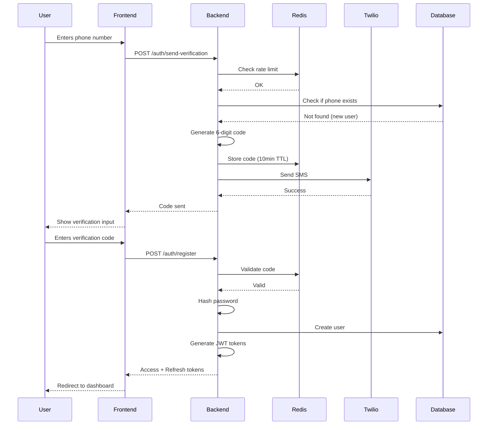

# Technical Implementation Guide - Clarence Insurance Platform

## Table of Contents
1. [Architecture Overview](#architecture-overview)
2. [Phone Registration & SMS Verification](#phone-registration--sms-verification)
3. [AI Document Parsing](#ai-document-parsing)
4. [Sandbox Quote Generation](#sandbox-quote-generation)
5. [Policy Document Generation](#policy-document-generation)
6. [Chat AI Implementation](#chat-ai-implementation)
7. [Security & Compliance](#security--compliance)
8. [Database Schema](#database-schema)
9. [Infrastructure & Deployment](#infrastructure--deployment)

---

## Architecture Overview

### Tech Stack Recommendations

**Frontend:**
- **Framework**: Next.js 14+ (React 18+)
- **UI Library**: Tailwind CSS + shadcn/ui
- **State Management**: Zustand or React Query
- **Forms**: React Hook Form + Zod validation
- **Real-time**: Socket.io or Pusher for chat
- **PWA**: next-pwa for mobile experience

**Backend:**
- **API**: Node.js + Express or Fastify
- **Language**: TypeScript
- **Validation**: Zod or Joi
- **ORM**: Prisma or TypeORM
- **Job Queue**: Bull or BullMQ (Redis-based)
- **Caching**: Redis

**Database:**
- **Primary**: PostgreSQL 15+
- **Document Store**: MongoDB (for policy documents, chat history)
- **Search**: Elasticsearch (optional, for advanced search)

**AI/ML:**
- **LLM**: OpenAI GPT-4 or Anthropic Claude
- **OCR**: AWS Textract or Google Cloud Vision
- **Vector DB**: Pinecone or Weaviate (for RAG)

**Infrastructure:**
- **Cloud**: AWS or Google Cloud Platform
- **Hosting**: Vercel (frontend) + AWS ECS/Lambda (backend)
- **CDN**: CloudFront or Cloudflare
- **File Storage**: AWS S3
- **Monitoring**: Datadog or New Relic

---

## Phone Registration & SMS Verification

### Implementation Flow



### Backend Implementation

#### 1. Phone Number Validation

```typescript
// utils/phoneValidation.ts
import { parsePhoneNumber, CountryCode } from 'libphonenumber-js'

export function validateUSPhoneNumber(phone: string): {
  isValid: boolean
  formatted: string | null
  error: string | null
} {
  try {
    const phoneNumber = parsePhoneNumber(phone, 'US' as CountryCode)
    
    if (!phoneNumber) {
      return { isValid: false, formatted: null, error: 'Invalid phone number' }
    }
    
    if (phoneNumber.country !== 'US') {
      return { 
        isValid: false, 
        formatted: null, 
        error: 'Only US phone numbers are supported' 
      }
    }
    
    if (!phoneNumber.isValid()) {
      return { isValid: false, formatted: null, error: 'Invalid phone number' }
    }
    
    return { 
      isValid: true, 
      formatted: phoneNumber.format('E.164'), // +15551234567
      error: null 
    }
  } catch (error) {
    return { isValid: false, formatted: null, error: 'Invalid phone number format' }
  }
}
```

#### 2. SMS Verification Service

```typescript
// services/smsService.ts
import twilio from 'twilio'
import { Redis } from 'ioredis'

const twilioClient = twilio(
  process.env.TWILIO_ACCOUNT_SID,
  process.env.TWILIO_AUTH_TOKEN
)

const redis = new Redis(process.env.REDIS_URL)

interface SendVerificationResult {
  success: boolean
  error?: string
  attemptsRemaining?: number
}

export class SMSService {
  private readonly MAX_ATTEMPTS = 3
  private readonly CODE_EXPIRY_SECONDS = 600 // 10 minutes
  private readonly RATE_LIMIT_WINDOW = 3600 // 1 hour

  async sendVerificationCode(
    phone: string, 
    purpose: 'registration' | 'password_reset'
  ): Promise<SendVerificationResult> {
    // Check rate limiting
    const rateLimitKey = `sms:ratelimit:${phone}`
    const attempts = await redis.incr(rateLimitKey)
    
    if (attempts === 1) {
      await redis.expire(rateLimitKey, this.RATE_LIMIT_WINDOW)
    }
    
    if (attempts > this.MAX_ATTEMPTS) {
      const ttl = await redis.ttl(rateLimitKey)
      return {
        success: false,
        error: `Too many attempts. Please try again in ${Math.ceil(ttl / 60)} minutes`,
        attemptsRemaining: 0
      }
    }

    // Generate 6-digit code
    const code = this.generateCode()
    
    // Store code in Redis
    const codeKey = `sms:code:${phone}:${purpose}`
    await redis.setex(codeKey, this.CODE_EXPIRY_SECONDS, code)
    
    // Store attempt count for this verification
    const attemptKey = `sms:attempts:${phone}:${purpose}`
    await redis.setex(attemptKey, this.CODE_EXPIRY_SECONDS, '0')

    try {
      // Send SMS via Twilio
      await twilioClient.messages.create({
        body: `Your Clarence verification code is: ${code}. Valid for 10 minutes.`,
        to: phone,
        from: process.env.TWILIO_PHONE_NUMBER
      })

      return {
        success: true,
        attemptsRemaining: this.MAX_ATTEMPTS - attempts
      }
    } catch (error) {
      console.error('SMS send error:', error)
      return {
        success: false,
        error: 'Failed to send SMS. Please try again.',
        attemptsRemaining: this.MAX_ATTEMPTS - attempts
      }
    }
  }

  async verifyCode(
    phone: string, 
    code: string, 
    purpose: 'registration' | 'password_reset'
  ): Promise<{ valid: boolean; error?: string }> {
    const codeKey = `sms:code:${phone}:${purpose}`
    const attemptKey = `sms:attempts:${phone}:${purpose}`
    
    // Get stored code
    const storedCode = await redis.get(codeKey)
    
    if (!storedCode) {
      return { valid: false, error: 'Code expired or not found' }
    }
    
    // Check verification attempts
    const attempts = parseInt(await redis.get(attemptKey) || '0')
    
    if (attempts >= 3) {
      await redis.del(codeKey) // Invalidate code
      return { valid: false, error: 'Too many failed attempts' }
    }

    // Verify code
    if (code !== storedCode) {
      await redis.incr(attemptKey)
      return { 
        valid: false, 
        error: `Incorrect code. ${3 - attempts - 1} attempts remaining` 
      }
    }

    // Code is valid - delete from Redis
    await redis.del(codeKey)
    await redis.del(attemptKey)
    
    return { valid: true }
  }

  private generateCode(): string {
    return Math.floor(100000 + Math.random() * 900000).toString()
  }
}
```

#### 3. Registration Controller

```typescript
// controllers/authController.ts
import { Request, Response } from 'express'
import bcrypt from 'bcrypt'
import { validateUSPhoneNumber } from '../utils/phoneValidation'
import { SMSService } from '../services/smsService'
import { UserService } from '../services/userService'
import { JWTService } from '../services/jwtService'

const smsService = new SMSService()
const userService = new UserService()
const jwtService = new JWTService()

export class AuthController {
  async sendVerification(req: Request, res: Response) {
    try {
      const { phone, purpose = 'registration' } = req.body

      // Validate phone number
      const validation = validateUSPhoneNumber(phone)
      if (!validation.isValid) {
        return res.status(400).json({
          success: false,
          error: {
            code: 'INVALID_PHONE_NUMBER',
            message: validation.error,
            field: 'phone'
          }
        })
      }

      // Check if phone already registered (for registration purpose)
      if (purpose === 'registration') {
        const existingUser = await userService.findByPhone(validation.formatted!)
        if (existingUser) {
          return res.status(400).json({
            success: false,
            error: {
              code: 'PHONE_ALREADY_REGISTERED',
              message: 'This phone number is already registered. Please log in.',
              field: 'phone'
            }
          })
        }
      }

      // Send verification code
      const result = await smsService.sendVerificationCode(
        validation.formatted!,
        purpose
      )

      if (!result.success) {
        return res.status(429).json({
          success: false,
          error: {
            code: 'RATE_LIMIT_EXCEEDED',
            message: result.error
          }
        })
      }

      return res.json({
        success: true,
        data: {
          message: 'Verification code sent',
          expires_in: 600,
          attempts_remaining: result.attemptsRemaining
        }
      })
    } catch (error) {
      console.error('Send verification error:', error)
      return res.status(500).json({
        success: false,
        error: {
          code: 'INTERNAL_ERROR',
          message: 'Failed to send verification code'
        }
      })
    }
  }

  async register(req: Request, res: Response) {
    try {
      const {
        phone,
        verification_code,
        password,
        email,
        first_name,
        last_name,
        quote_request_id
      } = req.body

      // Validate phone
      const validation = validateUSPhoneNumber(phone)
      if (!validation.isValid) {
        return res.status(400).json({
          success: false,
          error: {
            code: 'INVALID_PHONE_NUMBER',
            message: validation.error,
            field: 'phone'
          }
        })
      }

      // Verify SMS code
      const codeVerification = await smsService.verifyCode(
        validation.formatted!,
        verification_code,
        'registration'
      )

      if (!codeVerification.valid) {
        return res.status(400).json({
          success: false,
          error: {
            code: 'INVALID_VERIFICATION_CODE',
            message: codeVerification.error,
            field: 'verification_code'
          }
        })
      }

      // Validate password strength
      const passwordValidation = this.validatePassword(password)
      if (!passwordValidation.valid) {
        return res.status(400).json({
          success: false,
          error: {
            code: 'WEAK_PASSWORD',
            message: passwordValidation.error,
            field: 'password'
          }
        })
      }

      // Hash password
      const passwordHash = await bcrypt.hash(password, 12)

      // Create user
      const user = await userService.create({
        phone: validation.formatted!,
        password_hash: passwordHash,
        email,
        first_name,
        last_name
      })

      // Link quote request if exists
      if (quote_request_id) {
        await userService.linkQuoteRequest(user.id, quote_request_id)
      }

      // Generate JWT tokens
      const accessToken = jwtService.generateAccessToken(user.id)
      const refreshToken = jwtService.generateRefreshToken(user.id)

      // Store refresh token
      await userService.saveRefreshToken(user.id, refreshToken)

      return res.status(201).json({
        success: true,
        data: {
          user_id: user.id,
          phone: user.phone,
          email: user.email,
          access_token: accessToken,
          refresh_token: refreshToken,
          expires_in: 3600
        }
      })
    } catch (error) {
      console.error('Registration error:', error)
      return res.status(500).json({
        success: false,
        error: {
          code: 'INTERNAL_ERROR',
          message: 'Registration failed'
        }
      })
    }
  }

  async login(req: Request, res: Response) {
    try {
      const { phone, password } = req.body

      // Validate phone
      const validation = validateUSPhoneNumber(phone)
      if (!validation.isValid) {
        return res.status(400).json({
          success: false,
          error: {
            code: 'INVALID_CREDENTIALS',
            message: 'Invalid phone number or password'
          }
        })
      }

      // Find user
      const user = await userService.findByPhone(validation.formatted!)
      if (!user) {
        return res.status(401).json({
          success: false,
          error: {
            code: 'INVALID_CREDENTIALS',
            message: 'Invalid phone number or password'
          }
        })
      }

      // Verify password
      const passwordMatch = await bcrypt.compare(password, user.password_hash)
      if (!passwordMatch) {
        // Increment failed login attempts
        await userService.incrementFailedAttempts(user.id)
        
        return res.status(401).json({
          success: false,
          error: {
            code: 'INVALID_CREDENTIALS',
            message: 'Invalid phone number or password'
          }
        })
      }

      // Check if account is locked
      if (user.locked_until && new Date(user.locked_until) > new Date()) {
        return res.status(403).json({
          success: false,
          error: {
            code: 'ACCOUNT_LOCKED',
            message: 'Account temporarily locked due to too many failed attempts'
          }
        })
      }

      // Reset failed attempts
      await userService.resetFailedAttempts(user.id)

      // Generate JWT tokens
      const accessToken = jwtService.generateAccessToken(user.id)
      const refreshToken = jwtService.generateRefreshToken(user.id)

      // Store refresh token
      await userService.saveRefreshToken(user.id, refreshToken)

      return res.json({
        success: true,
        data: {
          user_id: user.id,
          access_token: accessToken,
          refresh_token: refreshToken,
          expires_in: 3600
        }
      })
    } catch (error) {
      console.error('Login error:', error)
      return res.status(500).json({
        success: false,
        error: {
          code: 'INTERNAL_ERROR',
          message: 'Login failed'
        }
      })
    }
  }

  private validatePassword(password: string): { valid: boolean; error?: string } {
    if (password.length < 8) {
      return { valid: false, error: 'Password must be at least 8 characters' }
    }
    
    if (!/[a-z]/.test(password)) {
      return { valid: false, error: 'Password must contain lowercase letter' }
    }
    
    if (!/[A-Z]/.test(password)) {
      return { valid: false, error: 'Password must contain uppercase letter' }
    }
    
    if (!/[0-9]/.test(password)) {
      return { valid: false, error: 'Password must contain a number' }
    }
    
    if (!/[^a-zA-Z0-9]/.test(password)) {
      return { valid: false, error: 'Password must contain a special character' }
    }
    
    return { valid: true }
  }
}
```

### Frontend Implementation

#### React Hook Form + Phone Input

```typescript
// components/RegistrationForm.tsx
'use client'

import { useState } from 'react'
import { useForm } from 'react-hook-form'
import { zodResolver } from '@hookform/resolvers/zod'
import { z } from 'zod'
import { PhoneInput } from './PhoneInput'
import { PasswordInput } from './PasswordInput'
import { VerificationCodeInput } from './VerificationCodeInput'

const registrationSchema = z.object({
  phone: z.string().regex(/^\+1[0-9]{10}$/, 'Invalid US phone number'),
  verification_code: z.string().length(6, 'Code must be 6 digits'),
  password: z.string()
    .min(8, 'Password must be at least 8 characters')
    .regex(/[a-z]/, 'Must contain lowercase letter')
    .regex(/[A-Z]/, 'Must contain uppercase letter')
    .regex(/[0-9]/, 'Must contain number')
    .regex(/[^a-zA-Z0-9]/, 'Must contain special character'),
})

type RegistrationForm = z.infer<typeof registrationSchema>

export function RegistrationForm({ quoteRequestId }: { quoteRequestId: string }) {
  const [step, setStep] = useState<'phone' | 'verification' | 'password'>('phone')
  const [isLoading, setIsLoading] = useState(false)
  const [error, setError] = useState<string | null>(null)

  const { register, handleSubmit, watch, formState: { errors } } = useForm<RegistrationForm>({
    resolver: zodResolver(registrationSchema),
  })

  const phone = watch('phone')

  const sendVerificationCode = async () => {
    setIsLoading(true)
    setError(null)

    try {
      const response = await fetch('/api/auth/send-verification', {
        method: 'POST',
        headers: { 'Content-Type': 'application/json' },
        body: JSON.stringify({ phone, purpose: 'registration' }),
      })

      const data = await response.json()

      if (!response.ok) {
        throw new Error(data.error.message)
      }

      setStep('verification')
    } catch (err: any) {
      setError(err.message)
    } finally {
      setIsLoading(false)
    }
  }

  const onSubmit = async (data: RegistrationForm) => {
    setIsLoading(true)
    setError(null)

    try {
      const response = await fetch('/api/auth/register', {
        method: 'POST',
        headers: { 'Content-Type': 'application/json' },
        body: JSON.stringify({
          ...data,
          quote_request_id: quoteRequestId,
        }),
      })

      const result = await response.json()

      if (!response.ok) {
        throw new Error(result.error.message)
      }

      // Store tokens
      localStorage.setItem('access_token', result.data.access_token)
      localStorage.setItem('refresh_token', result.data.refresh_token)

      // Redirect to dashboard
      window.location.href = '/dashboard'
    } catch (err: any) {
      setError(err.message)
    } finally {
      setIsLoading(false)
    }
  }

  return (
    <div className="max-w-md mx-auto p-6">
      <h2 className="text-2xl font-bold mb-4">
        Just one more step to see your quotes
      </h2>
      <p className="text-gray-600 mb-6">
        Your quote information is saved and being processed
      </p>

      {error && (
        <div className="bg-red-50 border border-red-200 text-red-700 px-4 py-3 rounded mb-4">
          {error}
        </div>
      )}

      <form onSubmit={handleSubmit(onSubmit)}>
        {step === 'phone' && (
          <>
            <PhoneInput
              {...register('phone')}
              error={errors.phone?.message}
              placeholder="(555) 123-4567"
            />
            <button
              type="button"
              onClick={sendVerificationCode}
              disabled={isLoading || !phone}
              className="w-full bg-blue-600 text-white py-3 rounded-lg mt-4 disabled:opacity-50"
            >
              {isLoading ? 'Sending...' : 'Send Verification Code'}
            </button>
          </>
        )}

        {step === 'verification' && (
          <>
            <VerificationCodeInput
              {...register('verification_code')}
              error={errors.verification_code?.message}
            />
            <button
              type="button"
              onClick={() => setStep('password')}
              disabled={isLoading}
              className="w-full bg-blue-600 text-white py-3 rounded-lg mt-4"
            >
              Verify Code
            </button>
            <button
              type="button"
              onClick={sendVerificationCode}
              className="w-full text-blue-600 py-2 mt-2"
            >
              Resend Code
            </button>
          </>
        )}

        {step === 'password' && (
          <>
            <PasswordInput
              {...register('password')}
              error={errors.password?.message}
            />
            <button
              type="submit"
              disabled={isLoading}
              className="w-full bg-blue-600 text-white py-3 rounded-lg mt-4 disabled:opacity-50"
            >
              {isLoading ? 'Creating Account...' : 'Create Account'}
            </button>
          </>
        )}
      </form>

      <p className="text-center mt-4 text-sm text-gray-600">
        Already have an account?{' '}
        <a href="/login" className="text-blue-600 hover:underline">
          Log in
        </a>
      </p>
    </div>
  )
}
```

---

## AI Document Parsing

### AWS Textract Integration

```typescript
// services/documentParsingService.ts
import { TextractClient, AnalyzeDocumentCommand } from '@aws-sdk/client-textract'
import { S3Client, PutObjectCommand, GetObjectCommand } from '@aws-sdk/client-s3'
import { OpenAI } from 'openai'

const textractClient = new TextractClient({ region: process.env.AWS_REGION })
const s3Client = new S3Client({ region: process.env.AWS_REGION })
const openai = new OpenAI({ apiKey: process.env.OPENAI_API_KEY })

interface ExtractedData {
  business_info?: {
    legal_name?: string
    address?: {
      street?: string
      city?: string
      state?: string
      zip?: string
    }
    confidence_score: number
  }
  coverage_info?: {
    current_coverages?: string[]
    current_limits?: Record<string, any>
    confidence_score: number
  }
}

export class DocumentParsingService {
  async parseDeclarationPage(
    fileBuffer: Buffer,
    fileName: string,
    documentType: string
  ): Promise<ExtractedData> {
    // 1. Upload to S3
    const s3Key = `uploads/${Date.now()}-${fileName}`
    await s3Client.send(new PutObjectCommand({
      Bucket: process.env.S3_BUCKET_NAME,
      Key: s3Key,
      Body: fileBuffer,
      ContentType: 'application/pdf'
    }))

    // 2. Extract text with Textract
    const textractResult = await textractClient.send(new AnalyzeDocumentCommand({
      Document: {
        S3Object: {
          Bucket: process.env.S3_BUCKET_NAME,
          Name: s3Key
        }
      },
      FeatureTypes: ['TABLES', 'FORMS']
    }))

    // 3. Parse Textract response
    const extractedText = this.parseTextractResponse(textractResult)

    // 4. Use GPT-4 to structure the data
    const structuredData = await this.structureWithGPT(extractedText, documentType)

    return structuredData
  }

  private parseTextractResponse(textractResult: any): string {
    let fullText = ''
    
    // Extract text from blocks
    if (textractResult.Blocks) {
      for (const block of textractResult.Blocks) {
        if (block.BlockType === 'LINE') {
          fullText += block.Text + '\n'
        }
      }
    }

    return fullText
  }

  private async structureWithGPT(
    rawText: string,
    documentType: string
  ): Promise<ExtractedData> {
    const prompt = `
You are an insurance document parser. Extract structured information from this ${documentType}.

Raw text from document:
${rawText}

Extract the following information and return as JSON:
{
  "business_info": {
    "legal_name": "string or null",
    "dba_name": "string or null",
    "address": {
      "street": "string or null",
      "city": "string or null",
      "state": "string or null",
      "zip": "string or null"
    },
    "fein": "string or null",
    "confidence_score": 0.0-1.0
  },
  "coverage_info": {
    "current_coverages": ["array of coverage types"] or null,
    "current_limits": {
      "coverage_type": {
        "per_occurrence": number or null,
        "aggregate": number or null
      }
    },
    "current_premium": number or null,
    "effective_date": "YYYY-MM-DD or null",
    "expiration_date": "YYYY-MM-DD or null",
    "carrier_name": "string or null",
    "confidence_score": 0.0-1.0
  }
}

Rules:
- Set confidence_score based on how certain you are about the extracted data
- Use null for any fields you cannot find or are uncertain about
- Standardize coverage types to: general_liability, professional_liability, cyber_liability, etc.
- Return ONLY valid JSON, no additional text
    `.trim()

    const completion = await openai.chat.completions.create({
      model: 'gpt-4-turbo-preview',
      messages: [
        { role: 'system', content: 'You are a precise insurance document parser.' },
        { role: 'user', content: prompt }
      ],
      response_format: { type: 'json_object' },
      temperature: 0.1
    })

    const content = completion.choices[0].message.content
    if (!content) {
      throw new Error('No response from GPT')
    }

    return JSON.parse(content) as ExtractedData
  }
}
```

---

## Sandbox Quote Generation

### LLM-Powered Quote Generator

```typescript
// services/quoteGenerationService.ts
import { OpenAI } from 'openai'
import { z } from 'zod'

const openai = new OpenAI({ apiKey: process.env.OPENAI_API_KEY })

interface QuoteRequest {
  business_info: {
    legal_name: string
    primary_industry: string
    industry_code: string
    address: {
      state: string
      city: string
    }
    year_started: number
  }
  financial_info: {
    revenue_2024: number
    full_time_employees: number
    part_time_employees: number
  }
  coverage_type: string
}

interface GeneratedQuote {
  quote_id: string
  carrier: {
    id: string
    name: string
    rating: string
  }
  coverage_type: string
  coverage_limits: Record<string, number>
  premium: {
    annual: number
    monthly: number
    quarterly: number
  }
  deductible: number
  highlights: string[]
  exclusions: string[]
  recommendation: {
    is_recommended: boolean
    reason: string
    confidence_score: number
  }
}

export class QuoteGenerationService {
  private readonly SIMULATED_CARRIERS = [
    { id: 'carrier_sim_001', name: 'Reliable Insurance Co.', rating: 'A+ (AM Best)' },
    { id: 'carrier_sim_002', name: 'Premier Underwriters', rating: 'A (AM Best)' },
    { id: 'carrier_sim_003', name: 'Guardian Coverage Group', rating: 'A (AM Best)' },
  ]

  async generateQuotes(
    quoteRequest: QuoteRequest,
    coverageType: string
  ): Promise<GeneratedQuote[]> {
    // Generate 3 quotes per coverage type from different carriers
    const quotes: GeneratedQuote[] = []

    for (const carrier of this.SIMULATED_CARRIERS) {
      const quote = await this.generateSingleQuote(quoteRequest, coverageType, carrier)
      quotes.push(quote)
    }

    // Sort by recommendation score
    quotes.sort((a, b) => b.recommendation.confidence_score - a.recommendation.confidence_score)

    // Mark best quote as recommended
    if (quotes.length > 0) {
      quotes[0].recommendation.is_recommended = true
    }

    return quotes
  }

  private async generateSingleQuote(
    quoteRequest: QuoteRequest,
    coverageType: string,
    carrier: { id: string; name: string; rating: string }
  ): Promise<GeneratedQuote> {
    const prompt = `
You are an insurance underwriting AI. Generate a realistic insurance quote based on this information:

Business: ${quoteRequest.business_info.legal_name}
Industry: ${quoteRequest.business_info.primary_industry}
Location: ${quoteRequest.business_info.address.city}, ${quoteRequest.business_info.address.state}
Revenue: $${quoteRequest.financial_info.revenue_2024}
Employees: ${quoteRequest.financial_info.full_time_employees} FT, ${quoteRequest.financial_info.part_time_employees} PT
Years in Business: ${new Date().getFullYear() - quoteRequest.business_info.year_started}

Coverage Type: ${coverageType}
Carrier: ${carrier.name}

Generate a quote with:
1. Appropriate coverage limits based on business size
2. Realistic annual premium (consider industry risk, location, revenue)
3. Appropriate deductible
4. 4-5 key highlights (what's covered)
5. 3-4 exclusions (what's NOT covered)
6. Additional features/endorsements

Return as JSON:
{
  "coverage_limits": {
    "per_occurrence": number,
    "general_aggregate": number,
    ...
  },
  "annual_premium": number,
  "deductible": number,
  "highlights": ["string", ...],
  "exclusions": ["string", ...],
  "additional_features": ["string", ...],
  "risk_assessment": {
    "risk_level": "low" | "medium" | "high",
    "reason": "string"
  }
}
    `.trim()

    const completion = await openai.chat.completions.create({
      model: 'gpt-4-turbo-preview',
      messages: [
        { 
          role: 'system', 
          content: 'You are an expert insurance underwriter with 20 years of experience.' 
        },
        { role: 'user', content: prompt }
      ],
      response_format: { type: 'json_object' },
      temperature: 0.7 // Some randomness for variety
    })

    const content = completion.choices[0].message.content
    if (!content) {
      throw new Error('No response from GPT')
    }

    const quoteData = JSON.parse(content)

    // Add realistic variance (±5-10%)
    const variance = 0.95 + Math.random() * 0.15
    const annualPremium = Math.round(quoteData.annual_premium * variance)

    const quote: GeneratedQuote = {
      quote_id: `qt_${Date.now()}_${Math.random().toString(36).substr(2, 9)}`,
      carrier: {
        id: carrier.id,
        name: `${carrier.name} (Simulated)`,
        rating: carrier.rating
      },
      coverage_type: coverageType,
      coverage_limits: quoteData.coverage_limits,
      premium: {
        annual: annualPremium,
        monthly: Math.round(annualPremium / 11), // 11 months (1 month free with annual)
        quarterly: Math.round(annualPremium / 4)
      },
      deductible: quoteData.deductible,
      highlights: quoteData.highlights,
      exclusions: quoteData.exclusions,
      recommendation: {
        is_recommended: false,
        reason: this.generateRecommendationReason(quoteData.risk_assessment),
        confidence_score: this.calculateConfidenceScore(quoteData)
      }
    }

    return quote
  }

  private generateRecommendationReason(riskAssessment: any): string {
    if (riskAssessment.risk_level === 'low') {
      return 'Best value for your business size and industry'
    } else if (riskAssessment.risk_level === 'medium') {
      return 'Good balance of coverage and price'
    } else {
      return 'Comprehensive coverage for higher risk profile'
    }
  }

  private calculateConfidenceScore(quoteData: any): number {
    // Score based on risk level and price competitiveness
    let score = 0.7

    if (quoteData.risk_assessment.risk_level === 'low') {
      score += 0.2
    } else if (quoteData.risk_assessment.risk_level === 'medium') {
      score += 0.1
    }

    // Add small random factor
    score += Math.random() * 0.1

    return Math.min(0.95, score)
  }
}
```

---

## Database Schema

### Prisma Schema

```prisma
// prisma/schema.prisma
datasource db {
  provider = "postgresql"
  url      = env("DATABASE_URL")
}

generator client {
  provider = "prisma-client-js"
}

model User {
  id                String    @id @default(uuid())
  phone             String    @unique
  email             String?   @unique
  password_hash     String
  first_name        String
  last_name         String
  
  email_verified    Boolean   @default(false)
  phone_verified    Boolean   @default(true)
  
  failed_login_attempts Int   @default(0)
  locked_until      DateTime?
  
  created_at        DateTime  @default(now())
  updated_at        DateTime  @updatedAt
  last_login_at     DateTime?
  
  quote_requests    QuoteRequest[]
  policies          Policy[]
  chat_sessions     ChatSession[]
  refresh_tokens    RefreshToken[]
  
  @@index([phone])
  @@index([email])
}

model RefreshToken {
  id          String   @id @default(uuid())
  user_id     String
  token       String   @unique
  expires_at  DateTime
  created_at  DateTime @default(now())
  revoked_at  DateTime?
  
  user        User     @relation(fields: [user_id], references: [id], onDelete: Cascade)
  
  @@index([user_id])
  @@index([token])
}

model QuoteRequest {
  id                    String    @id @default(uuid())
  user_id               String?
  status                String    @default("pending") // pending, processing, completed, expired
  
  // Business Information
  insurance_type        String    // personal, commercial
  coverage_need         String    // new_coverage, renewal_help
  legal_name            String
  dba_name              String?
  legal_structure       String
  website               String?
  primary_industry      String
  industry_code         String
  business_description  String
  fein                  String?
  year_started          Int
  years_current_ownership Int?
  
  // Address
  address_street        String
  address_city          String
  address_state         String
  address_zip           String
  address_type          String    // physical, virtual
  
  // Financial Info
  revenue_2024          Decimal
  expenses_2024         Decimal
  estimated_revenue_2025 Decimal
  estimated_expenses_2025 Decimal
  full_time_employees   Int
  part_time_employees   Int
  total_payroll         Decimal
  independent_contractor_percentage Decimal
  
  // Business Details
  has_subsidiaries      Boolean   @default(false)
  has_foreign_subsidiaries Boolean @default(false)
  multiple_entities     Boolean   @default(false)
  
  // Coverage Selections
  coverage_selections   String[]  // Array of coverage types
  
  // Contact Info
  contact_first_name    String
  contact_last_name     String
  contact_email         String
  contact_phone         String
  
  // Additional
  additional_comments   String?
  
  // Metadata
  estimated_completion  DateTime?
  completed_at          DateTime?
  created_at            DateTime  @default(now())
  updated_at            DateTime  @updatedAt
  
  user                  User?     @relation(fields: [user_id], references: [id], onDelete: SetNull)
  uploaded_documents    UploadedDocument[]
  quotes                Quote[]
  
  @@index([user_id])
  @@index([status])
  @@index([created_at])
}

model UploadedDocument {
  id                  String    @id @default(uuid())
  quote_request_id    String?
  user_id             String?
  
  file_name           String
  file_size           Int
  file_type           String
  s3_key              String
  s3_url              String
  
  document_type       String    // declaration_page, business_license, other
  extraction_status   String    @default("pending") // pending, processing, completed, failed
  extracted_data      Json?
  
  created_at          DateTime  @default(now())
  
  quote_request       QuoteRequest? @relation(fields: [quote_request_id], references: [id], onDelete: Cascade)
  
  @@index([quote_request_id])
  @@index([extraction_status])
}

model Quote {
  id                  String    @id @default(uuid())
  quote_request_id    String
  quote_number        String    @unique
  
  // Carrier Info
  carrier_id          String
  carrier_name        String
  carrier_logo_url    String?
  carrier_rating      String?
  
  // Coverage
  coverage_type       String
  coverage_limits     Json
  deductible          Int
  
  // Pricing
  annual_premium      Decimal
  monthly_premium     Decimal
  quarterly_premium   Decimal
  
  // Details
  effective_date      DateTime
  expiration_date     DateTime
  highlights          String[]
  exclusions          String[]
  additional_features String[]
  
  // Recommendation
  is_recommended      Boolean   @default(false)
  recommendation_reason String?
  confidence_score    Decimal
  
  // Status
  status              String    @default("active") // active, expired, selected, rejected
  valid_until         DateTime
  
  created_at          DateTime  @default(now())
  updated_at          DateTime  @updatedAt
  
  quote_request       QuoteRequest @relation(fields: [quote_request_id], references: [id], onDelete: Cascade)
  
  @@index([quote_request_id])
  @@index([status])
  @@index([coverage_type])
}

model Policy {
  id                  String    @id @default(uuid())
  user_id             String
  policy_number       String    @unique
  
  // Coverage
  coverage_type       String
  carrier_id          String
  carrier_name        String
  
  // Dates
  effective_date      DateTime
  expiration_date     DateTime
  issued_date         DateTime
  
  // Premium
  annual_premium      Decimal
  payment_plan        String    // annual, monthly, quarterly
  payment_amount      Decimal
  next_payment_date   DateTime?
  auto_renewal        Boolean   @default(false)
  
  // Coverage Details
  coverage_limits     Json
  deductible          Int
  
  // Status
  status              String    @default("active") // active, expired, cancelled
  cancellation_date   DateTime?
  cancellation_reason String?
  
  // Documents
  policy_document_url String?
  
  created_at          DateTime  @default(now())
  updated_at          DateTime  @updatedAt
  
  user                User      @relation(fields: [user_id], references: [id], onDelete: Cascade)
  certificates        Certificate[]
  renewals            Renewal[]
  
  @@index([user_id])
  @@index([status])
  @@index([expiration_date])
}

model Certificate {
  id                    String    @id @default(uuid())
  policy_id             String
  certificate_number    String    @unique
  
  certificate_holder_name     String
  certificate_holder_address  String
  
  description_of_operations   String?
  special_provisions          String?
  additional_insured          Boolean   @default(false)
  
  issued_date           DateTime
  document_url          String
  
  created_at            DateTime  @default(now())
  
  policy                Policy    @relation(fields: [policy_id], references: [id], onDelete: Cascade)
  
  @@index([policy_id])
}

model Renewal {
  id                  String    @id @default(uuid())
  policy_id           String
  renewal_type        String    // one_click, review_update, shop_compare
  status              String    @default("not_started") // not_started, in_progress, completed, declined
  
  current_premium     Decimal
  estimated_new_premium Decimal?
  
  business_changes    Json?
  ai_recommendations  Json?
  
  reminder_90_days_sent Boolean @default(false)
  reminder_60_days_sent Boolean @default(false)
  reminder_45_days_sent Boolean @default(false)
  reminder_30_days_sent Boolean @default(false)
  reminder_15_days_sent Boolean @default(false)
  reminder_7_days_sent  Boolean @default(false)
  
  created_at          DateTime  @default(now())
  updated_at          DateTime  @updatedAt
  completed_at        DateTime?
  
  policy              Policy    @relation(fields: [policy_id], references: [id], onDelete: Cascade)
  
  @@index([policy_id])
  @@index([status])
}

model ChatSession {
  id          String    @id @default(uuid())
  user_id     String
  status      String    @default("active") // active, closed, escalated
  
  context     Json?     // Page, policy_id, etc.
  
  escalated_at DateTime?
  escalated_to_agent_id String?
  
  created_at  DateTime  @default(now())
  updated_at  DateTime  @updatedAt
  
  user        User      @relation(fields: [user_id], references: [id], onDelete: Cascade)
  messages    ChatMessage[]
  
  @@index([user_id])
  @@index([status])
}

model ChatMessage {
  id              String    @id @default(uuid())
  chat_session_id String
  
  role            String    // user, assistant, system
  content         String
  
  citations       Json?
  suggested_actions Json?
  
  created_at      DateTime  @default(now())
  
  chat_session    ChatSession @relation(fields: [chat_session_id], references: [id], onDelete: Cascade)
  
  @@index([chat_session_id])
  @@index([created_at])
}
```

---

## Security & Compliance

### Security Checklist

#### Authentication & Authorization
- ✅ JWT tokens with short expiration (1 hour access, 7 days refresh)
- ✅ Secure password hashing (bcrypt with salt rounds ≥ 12)
- ✅ Rate limiting on all endpoints
- ✅ Account lockout after 5 failed login attempts
- ✅ SMS verification for phone-based registration
- ✅ CSRF protection on state-changing endpoints
- ✅ HTTP-only cookies for refresh tokens

#### Data Protection
- ✅ Encryption at rest (AWS RDS encryption, S3 encryption)
- ✅ Encryption in transit (TLS 1.3)
- ✅ PII data encryption in database
- ✅ Secure file upload validation (file type, size, content)
- ✅ Signed URLs for document access (expire in 1 hour)

#### Compliance
- ✅ SOC 2 Type II compliance
- ✅ GDPR compliance (data export, deletion, consent)
- ✅ CCPA compliance (data access, deletion rights)
- ✅ Insurance-specific regulations per state
- ✅ Audit logging for all data access and changes

#### API Security
- ✅ Input validation on all endpoints
- ✅ SQL injection prevention (parameterized queries)
- ✅ XSS prevention (content sanitization)
- ✅ CORS properly configured
- ✅ API versioning
- ✅ Request signing for sensitive operations

---

## Infrastructure & Deployment

### AWS Architecture

```
┌─────────────────────────────────────────────────────────┐
│                      CloudFront CDN                      │
└────────────────────┬────────────────────────────────────┘
                     │
        ┌────────────┴─────────────┐
        │                          │
┌───────▼────────┐        ┌────────▼──────────┐
│   Next.js on   │        │   API Gateway     │
│    Vercel      │        │                   │
└────────────────┘        └───────┬───────────┘
                                  │
                    ┌─────────────┼──────────────┐
                    │             │              │
           ┌────────▼───┐  ┌──────▼────┐  ┌─────▼──────┐
           │  Lambda/   │  │  Lambda/  │  │  Lambda/   │
           │  ECS API   │  │  Workers  │  │  Webhooks  │
           └────┬───────┘  └─────┬─────┘  └─────┬──────┘
                │                │              │
                └────────┬───────┴──────────────┘
                         │
        ┌────────────────┼────────────────┐
        │                │                │
┌───────▼──────┐  ┌──────▼──────┐  ┌─────▼─────┐
│  PostgreSQL  │  │    Redis    │  │  MongoDB  │
│     RDS      │  │  ElastiCache│  │   Atlas   │
└──────────────┘  └─────────────┘  └───────────┘
        │
        │
┌───────▼──────────────────────────────┐
│  S3 Buckets (Documents, Policies)   │
└──────────────────────────────────────┘
```

### CI/CD Pipeline

```yaml
# .github/workflows/deploy.yml
name: Deploy Clarence Platform

on:
  push:
    branches: [main, staging]

jobs:
  test:
    runs-on: ubuntu-latest
    steps:
      - uses: actions/checkout@v3
      - uses: actions/setup-node@v3
        with:
          node-version: '18'
      - run: npm ci
      - run: npm run test
      - run: npm run lint

  deploy-frontend:
    needs: test
    runs-on: ubuntu-latest
    steps:
      - uses: actions/checkout@v3
      - uses: amondnet/vercel-action@v25
        with:
          vercel-token: ${{ secrets.VERCEL_TOKEN }}
          vercel-org-id: ${{ secrets.VERCEL_ORG_ID }}
          vercel-project-id: ${{ secrets.VERCEL_PROJECT_ID }}

  deploy-backend:
    needs: test
    runs-on: ubuntu-latest
    steps:
      - uses: actions/checkout@v3
      - uses: aws-actions/configure-aws-credentials@v2
        with:
          aws-access-key-id: ${{ secrets.AWS_ACCESS_KEY_ID }}
          aws-secret-access-key: ${{ secrets.AWS_SECRET_ACCESS_KEY }}
          aws-region: us-east-1
      - run: |
          docker build -t clarence-api .
          docker tag clarence-api:latest $ECR_REGISTRY/clarence-api:latest
          docker push $ECR_REGISTRY/clarence-api:latest
      - run: aws ecs update-service --cluster clarence-prod --service clarence-api --force-new-deployment
```

---

## Monitoring & Observability

### Key Metrics to Track

**Performance:**
- API response time (p50, p95, p99)
- Quote generation time
- Document parsing time
- Database query performance

**Business:**
- Quote request completion rate
- Quote-to-purchase conversion rate
- Registration completion rate
- SMS delivery success rate
- Average time to quote

**Errors:**
- 5xx error rate
- 4xx error rate
- Failed payments
- Failed SMS deliveries
- Document parsing failures

**Security:**
- Failed login attempts
- Suspicious activity patterns
- Rate limit hits
- Unauthorized access attempts

---

This technical implementation guide provides the foundation for building the Clarence platform. Each section can be expanded based on specific requirements and technical decisions made during development.


